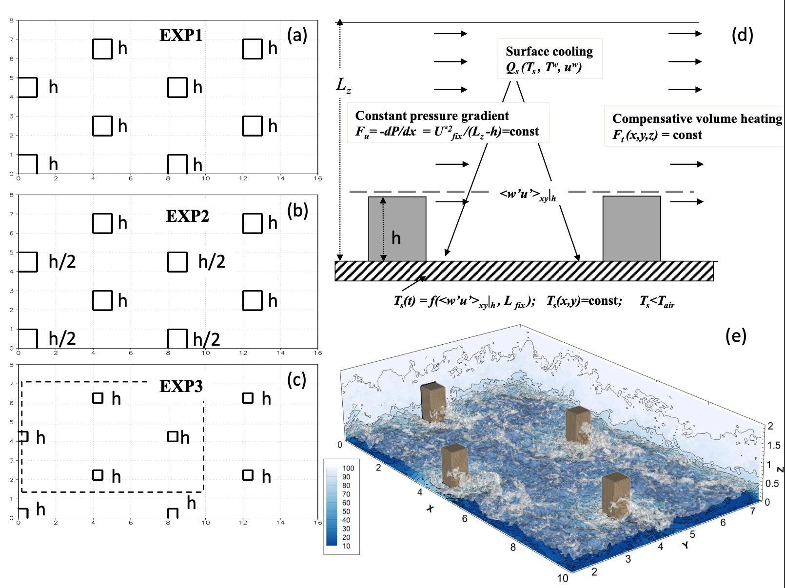

## Overview
Motivation for this project can be summed up in few key points


- Bright future: microscale turbulence resolving models – essential element of urban services and planning
- Aiding urban-canopy parameterizations in meso-scale & global-scale atmospheric models
- How good is LES in reproducing urban boundary layer?
- What approaches (numerics + physics) work best?


## Participants

Currently there are 2 paticipant models: 
- LES from RCC LMSU 
> Mixed dynamic subgrid closure + nesting
> Double-moment cloud microphysics & radiation (RRTM) modules
> Land surface coupling
> Atmospheric chemistry & aerosol transport
> CPU/GPU support via C/C++/MPI/OpenMP/CUDA

- Fluidity from Institute of Atmospheric Physics CAS
> Basic Information for Fluidity:
> Numerics:
> Spatial discretisations: first-order and second-order Continuous Galerkin, Discontinuous Galerkin, Control Volume
> Temporal discretisation: first-order explicit, second-order semi-implicit and implicit
> Turbulence Package:
> Reynolds-Averaged Navier-Stokes (RANS) Modelling
> Generic length scale turbulence parameterization (based on two equations, for the transport of turbulent kinetic energy (TKE) and a generic second quantity)
> Standard k – ε Turbulence Model
> Large-Eddy Simulation (LES):
> Second-order dissipation model
> Fourth-order dissipation model
> Dynamic Smagorinsky model

 to become a participant send an email to [Andrey Debolskiy](and.debol@srcc.msu.ru) or [Evgeny Mortikov](mortikov@srcc.msu.ru)

## Stages

### Idealized urban configurations
The preliminary setup follows JAS paper [1](https://journals.ametsoc.org/view/journals/atsc/80/1/JAS-D-22-0044.1.xml)
here is a scheme for the experiments


for testing non-stratified flow is considered. 
[Here](pages/idealized.html) has detailed description of the idealized setup. Below is just a breif overview

- Domain: `length = 256 m, width = 128 m,  height = 64.0 m; `
- Grid: `nx = 512; ny = 256; nz = 128`, so that uniform resolution of 0.5m in any direction is achieved
- Flow configuration: Open Channel flow with constant external pressure gradient of `dpdx =  - phys.rho_ref * ustar_r^2 /(height - buildings_height)`, where `phys.rho_ref = 1.25 kg/m^3` is reference air density, `ustar_roof = 0.25` is target dynamic velocity just above the building roofs .
- Other fluid characteristics:
```
        f = 0.0;                                # coriolis frequency [1/s]

        nu = 1.25 * 0.00001;                    # kinematic viscosity [m^2/s]
        xi = (1.0 / 0.7) * nu;                  # thermal diffusivity [m^2/s]

        rho_ref = 1.25;                         # reference density of air [kg/m^3]

        g = 9.81;                               # gravitational acceleration [m/s^2]
        Theta_ref = 283.15;                     # reference temperature [K]

        # --- no buoyancy
        beta = 0.0;                             # = g * thermal expansion coefficient = g / Theta_ref [m/(K*s^2)]
```
- Integration model time: 2hours
- Buildings setup: surface dynamic and thermal roughness parameters `z0m = 0.01 m`, `z0h = z0m/10.0`. `building_height = 16 m`. 
- Building configuration: EXP1
```
h = 16 # [m], building height
        patch_1 {
                type = "box";

                xmin = 0.0; xmax = h;   # patch dimensions
                ymin =  0.0; ymax = h;
                height = h;

                xperiod = 8.0 * h;                      #  periodicity in -x
                yperiod = 4.0 * h;                      #  periodicity in -y
        }
        patch_2 {
                type = "box";                   # patch type: "box" || "hill"

                xmin = 4.0 * h ; xmax = 5.0 * h;   # patch dimensions
                ymin =  2.0 * h; ymax = 3.0 * h;
                height = h;

                xperiod = 8.0 * h;                  # periodicity in -x
                yperiod = 4.0 * h;                  # periodicity in -y
        }
```
- EXP2 
```
h = 16 # [m], building height
        patch_1 {
                type = "box";

                xmin = 0.0; xmax = h;   # patch dimensions
                ymin =  0.0; ymax = h;
                height = h;

                xperiod = 8.0 * h;                      #  periodicity in -x
                yperiod = 4.0 * h;                      #  periodicity in -y
        }
        patch_2 {
                type = "box";                   # patch type: "box" || "hill"

                xmin = 4.0 * h ; xmax = 5.0 * h;   # patch dimensions
                ymin =  2.0 * h; ymax = 3.0 * h;
                height = h/2.0;

                xperiod = 8.0 * h;                  # periodicity in -x
                yperiod = 4.0 * h;                  # periodicity in -y
        }
```
- EXP3

```
h = 16 # [m], building height
        patch_1 {
                type = "box";

                xmin = 0.0; xmax = h/2.0;   # patch dimensions
                ymin =  0.0; ymax = h/2.0;
                height = h;

                xperiod = 8.0 * h;                      #  periodicity in -x
                yperiod = 4.0 * h;                      #  periodicity in -y
        }
        patch_2 {
                type = "box";                   # patch type: "box" || "hill"

                xmin = 4.0 * h ; xmax = 4.5 * h;   # patch dimensions
                ymin =  2.0 * h; ymax = 2.5 * h;
                height = h;

                xperiod = 8.0 * h;                  # periodicity in -x
                yperiod = 4.0 * h;                  # periodicity in -y
        }
```
#### Stratified idealized urban cases
coming soon
### Realistic urban developments
cooming soon

## Outputs

for output see notebooks [here](https://github.com/anddebol/ulescomp/tree/main/notebooks)

Example of output for EXP1


## Comparison

